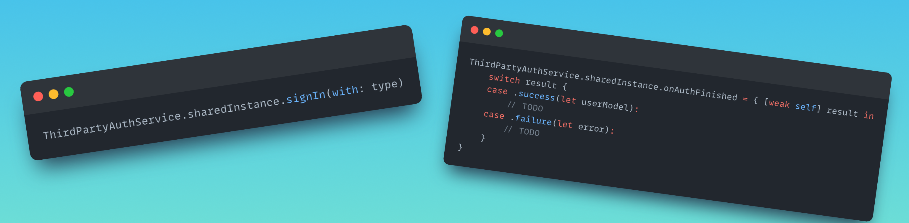
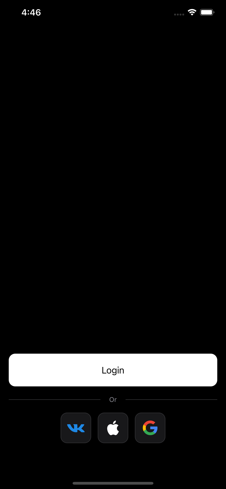

# ThirdPartyAuth

[](https://github.com/surfstudio/ThirdPartyAuth/actions/workflows/main.yml)
[](https://github.com/apple/swift-package-manager)
[]()


## About

Library for quick register or login into your application using third party accounts. It has two main modules - **ThirdPartyAuth** and **ThirdPartyAuthUI**.
- **ThirdPartyAuth** module include components for auth / register user's in your app with their third party accounts. After getting response from this module you'll need to sent all necessary data to your backend-side and process them there.
- **ThirdPartyAuthUI** is a set of components that you can integrate into your app, if you don't need custom UI. 



## Features

- [x] Sign In with Apple
- [x] Google Sign-In
- [x] VK ID

## Prepare your app project

Before using this library you'll need to check, is your project matches all needed auth types requirements.

Detailed info you can find [here](TechDocs/PrepareProject.md).

## Installation

### Swift Package Manager

- Open your Xcode project and select `File > Add Packages...`
- Enter repository URL `https://github.com/AdmiralBizon/ThirdPartyAuth`
- Select branch `main`

## Usage

### ThirdPartyAuth

This module has a single public interface - `ThirdPartyAuthService`, included all main operations.

Sign In:

```swift
ThirdPartyAuthService.sharedInstance.signIn(with: type)
```

Sign Out:

```swift
ThirdPartyAuthService.sharedInstance.signOut(with: type) { isSignedOut in
    // do something useful
}
```

Here `type` parameter is one of `ThirdPartyAuthService` current configuration supported types. For example, `.google`. 

Detailed usage info of this module you can find [here](TechDocs/Modules/ThirdPartyAuth.md).

### ThirdPartyAuthUI

It's a set of components that you can integrate into your app, if you don't need custom UI. 

Library has two main UI-components:

- Title view of third party auth section
- Button container - main component of ThirdPartyAuthUI, included block with auth buttons of all needed auth types

Detailed usage info of this module you can find [here](TechDocs/Modules/ThirdPartyAuthUI.md).

<details>
    <summary>Preview</summary>
    <p align="center">
         &nbsp;&nbsp;&nbsp;&nbsp;
    </p>
</details>

## Changelog

The full list of changes can be found in [this file](./CHANGELOG.md).

## License

[MIT License](./LICENSE)
